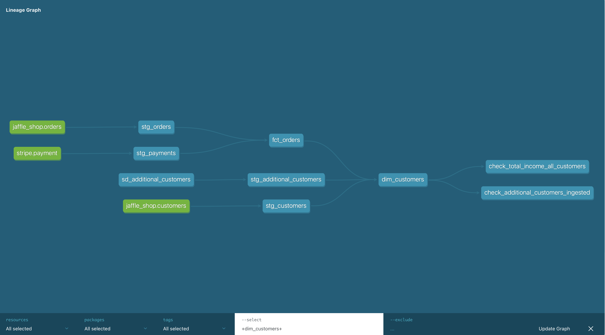

# Repository for the dbt courses



## dbt documentation

<https://courses.getdbt.com/courses>
<https://docs.getdbt.com/guides/best-practices>
<https://docs.getdbt.com/docs/introduction>
<https://docs.getdbt.com/reference/references-overview>

## Snowflake instance

<https://qr92018.eu-west-2.aws.snowflakecomputing.com/>

# Setup

Install dbt in a virtual environment

```bash
pip install --no-dependencies -r requirements.txt
```

Create a `~/.dbt/profiles.yml`

```
personal_profile:
  target: dev
  outputs:
    dev:
      type: snowflake
      account: ****
      user: ****
      password: ****
      role: ****
      database: ****
      warehouse: ****
      schema: ****
      threads: 8
      client_session_keep_alive: False
      query_tag: ****
      connect_retries: 0
      connect_timeout: 10
      retry_on_database_errors: False
      retry_all: False
      reuse_connections: False
```

Check connection

```bash
dbt deps
dbt debug
```

Create database, schemas and tables

```bash
dbt run-operation create_db_objects
dbt run-operation create_sample_src_tables
```

Build and test dbt models

```bash
dbt build
```

## Notes on materializations in dbt

Materialization defines how dbt builds the models (select statements).

* Tables: Copy of the data from upstream into a NEW table.
  * Higher build time and more storage usage, but shorter query time
  * If new record added in upstream stable, model/table is rebuilt from scratch.
* Views: No copy, data remains in the upstream table, and the query is run every time we do a select on the view.
  * Quicker build time and less storage usage, but longer query time
  * If new record added in upstream stable, it will be part of the view/query, but slower.
* Ephemeral: Brings CTE into downstream models (another select statement), but no persistent storage, do not exist in the DB.
  * Can be used if too many CTEs in a model, and it makes sense to break it down, or that the CTE can be reused
  in other downstream models, but we don't want to store the data.
  Help reduces the amount of tables in the WH, but harder to debug, cannot be queried directly.
* Incremental: Only brings in new records in upstream tables, do not rebuild the table from scratch
* Snapshot: Look at changed records, if anything changes, bring the updated records as a NEW row - no loss of information
  * Used for type 2 slowly changing dimension tables: <https://docs.getdbt.com/docs/build/snapshots>
  * Preserve the history of changing fields (e.g. dobjects, sec master)
  * Snapshots: <https://courses.getdbt.com/courses/take/advanced-materializations/lessons/30195287-implementing-snapshots>
  * Usually applied on source tables

Generally, start with a view, when it takes too long to query, "upgrade" the model to a table.
When the table takes too long to build, consider upgrading to an incremental table.
Upgrading to an incremental table is not straightforward, follow the [dbt documentation](https://courses.getdbt.com/courses/take/advanced-materializations/lessons/30195285-incremental-models)

## Node selection syntax

<https://docs.getdbt.com/reference/node-selection/syntax>

## Tests

* Native tests and packages (dbt_expectations) in yml
* Singular tests: sql files in the tests/ folder, with reference to models.
  Tests business logic and shows up in the lineage graph.
* Generic tests, macro-like, parameterized sql, which are reusable across models.
  Usually start with a singular test (pure sql) then "promote" to a generic tests for reusability.
* Override native tests by creating a generic tests with the same name, e.g 'not_null', for customization
